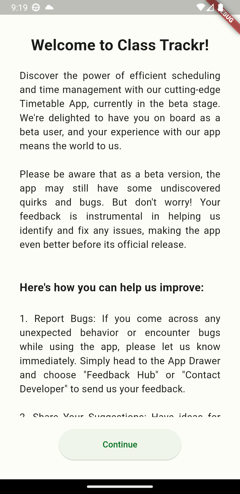

# Class Trackr (Made with Flutter) (Archived)

[](https://github.com/sreeram3927/class_trackr/stargazers)
[](https://github.com/sreeram3927/class_trackr/network/members)
[](https://github.com/sreeram3927/class_trackr/issues)
[](LICENSE)

### Note to Developers
If you don't understand my code, I understand. Doc strings will be added soon, until then feel free to play around with the source code. Thank You!


### App Preview


## Overview

The University Class Tracker is a Flutter app designed to help students of SRMIST to keep track of their classes and manage their schedules efficiently. The app utilizes Firebase for syncing current day order details, including holidays and other relevant information.

## Features

- **Class Schedule**: Easily manage and view your class schedule.

- **Firebase Integration**: Syncs current day order details, ensuring up-to-date information.

- **Holiday Tracking**: Keep track of holidays and special events that may affect your schedule.

## Getting Started

These instructions will help you set up and run the project on your local machine.

### Prerequisites

- Flutter SDK: [Installation Guide](https://flutter.dev/docs/get-started/install)
- Firebase Account: [Firebase Console](https://console.firebase.google.com/)

### Installation

1. **Clone the Repository**:

   ```bash
   git clone https://github.com/sreeram3927/class_trackr.git
   ```

2. **Navigate to the Project Directory**

    ```bash
    cd class_trackr
    ```

3. **Install Dependencies**

    ```bash
    flutter pub get
    ```

4. **Configure Firebase**

    ```bash
    dart pub global activate flutterfire_cli
    flutterfire configure
    ```
    or

    - Visit the [Firebase Console](https://console.firebase.google.com/) and log in with your Google account.
    - Click on "Add project" to create a new project.
    - Follow the on-screen instructions to set up your project.
    - Go to your Project settings and add apps manually (Scroll down and click *Add app*)


4. **Run the app**

    ```bash
    flutter run
    ```

## Contributing

We welcome contributions from the community! Whether you're interested in fixing bugs, adding new features, or improving documentation, please feel free to open issues and pull requests.

## License

This project is under the [MIT License](https://github.com/sreeram3927/class_trackr/blob/main/LICENSE).

## Screenshots

### Onboarding Pages

 

### Home Page

  

### Settings Page

 
 

### Edit Timetable Page


## Contact

If you have any queston, suggestion, or feedback, feel free to reach out to me.

Github: [sreeram3927](https://github.com/Sreeram3927)

LinkedIn: [/in/sreeram3927](https://linkedin.com/in/Sreeram3927)

X: [sreeram3927](https://twitter.com/sreeram3927)
